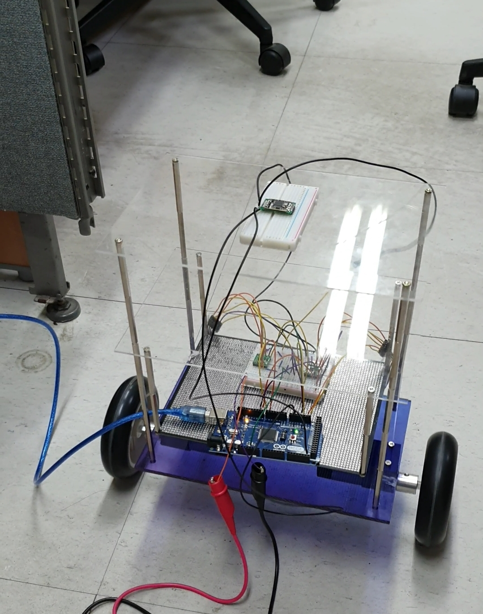

# InvertedPendulum_ArduinoMega

Arduino Mega 2560 based inverted pendulum project with milestone sketches showing the development path from motor and IMU tests to the final balancing controller.

## Overview

This project implements a two-wheeled self-balancing robot based on Arduino Mega 2560.

The final controller combines:

- EBIMU attitude data received through `Serial3`
- Wheel position and speed estimated from left and right quadrature encoders
- An LQR-based state-feedback control law that converts the robot state into motor voltage and PWM commands

The goal is to keep the body upright while driving both wheels in the direction needed to recover balance.

## Demo

- Actual operation video: [YouTube Shorts](https://youtube.com/shorts/jhDkIAMifP8?feature=share)
  - You can see the real balancing behavior of the system in this video.

## Project Structure

- `final/`
  - Final working sketch.
- `stages/`
  - Milestone sketches kept as representative development steps.

## Final Sketch

- `final/final_balancing_controller/final_balancing_controller.ino`
  - Final balancing controller version.

## Final Control Method

The final sketch uses an LQR-based state-feedback balancing controller.

At every control cycle, it estimates four state values:

- `u1`: average wheel position
- `u2`: average wheel speed
- `u3`: body pitch angle from the IMU, including a fixed pitch offset and a small manual trim value
- `u4`: pitch angular speed, computed from the change in pitch angle

The control input is calculated as a weighted sum of these states:

- `voltage = -(k1*u1 + k2*u2 + k3*u3 + k4*u4) / 200`

In the final version, the tuned gains are:

- `k1 = 0`
- `k2 = -122.3257`
- `k3 = 350`
- `k4 = 45`

The computed voltage is then:

- limited to the motor supply range
- converted to PWM
- used to decide motor direction from the sign of the control input

This means the robot balances mainly using pitch angle, pitch rate, and wheel speed feedback, while wheel position feedback is currently disabled in the final tuned gains.

## Milestones

- `stages/milestone01_motor_oneside/milestone01_motor_oneside.ino`
  - Single motor and encoder speed test.
- `stages/milestone02_imu_parser/milestone02_imu_parser.ino`
  - EBIMU serial parsing test.
- `stages/milestone03_dual_motor_encoder/milestone03_dual_motor_encoder.ino`
  - Dual motor and encoder measurement on Arduino Mega.
- `stages/milestone04_sensor_motor_integration/milestone04_sensor_motor_integration.ino`
  - First integration of IMU input with motor control.
- `stages/milestone05_first_balance_control/milestone05_first_balance_control.ino`
  - First version with state-based balance control logic.
- `stages/milestone06_pre_final_tuning/milestone06_pre_final_tuning.ino`
  - Pre-final tuning version before the final controller.

## Notes

- The sketches are organized so that each folder name matches its `.ino` file name for Arduino IDE compatibility.
- The final and milestone sketches target Arduino Mega 2560.
- IMU-related sketches use `Serial3` for EBIMU communication.
